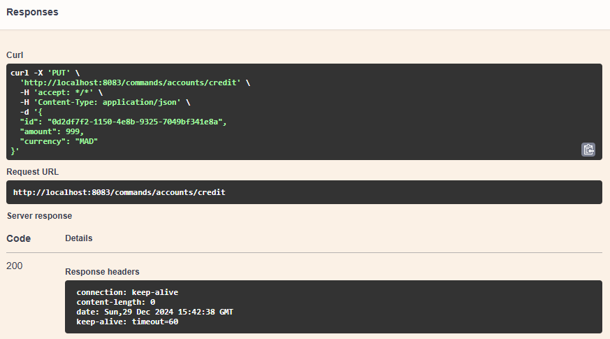

# Simple Demo of Spring Boot with Axon Framework (CQRS & Event Sourcing)

This repository shows a **minimal** example of how to implement [CQRS](https://martinfowler.com/bliki/CQRS.html) and **Event Sourcing** in a Spring Boot application using the [Axon Framework](https://axoniq.io/).

---

## What are CQRS and Event Sourcing?

> [!NOTE]  
> **CQRS (Command Query Responsibility Segregation)**: A pattern that separates the write side (commands/updates) from the read side (queries) of an application. By doing so, the **Command** side can focus on changing state, while the **Query** side can focus on reading state.

> [!NOTE]
> **Event Sourcing**: Instead of storing the “current” state of an entity directly, we store a sequence of **events** that happened to it. The current state is then derived from replaying or projecting these events. This makes the system auditable and allows easy state replay/recovery.

---

## Dependencies

Add Axon and remove the Axon Server Connector (if you don’t plan on using Axon Server):

```xml
<dependency>
    <groupId>org.axonframework</groupId>
    <artifactId>axon-spring-boot-starter</artifactId>
    <version>4.10.3</version>
    <exclusions>
        <exclusion>
            <groupId>org.axonframework</groupId>
            <artifactId>axon-server-connector</artifactId>
        </exclusion>
    </exclusions>
</dependency>
```

For easy API testing (via Swagger/OpenAPI UI), add:

```xml
<dependency>
    <groupId>org.springdoc</groupId>
    <artifactId>springdoc-openapi-starter-webmvc-ui</artifactId>
    <version>2.7.0</version>
</dependency>
```

---

## How It Works

### Common API
This module contains shared classes:
- **Commands** (e.g. `CreateAccountCommand`, `CreditAccountCommand`)
- **Events** (e.g. `AccountCreatedEvent`, `AccountCreditedEvent`)
- **DTOs** used by both command and query sides

### Command Side (Write)
- **Aggregate**: Where your domain logic lives.
  - Annotated with `@Aggregate`
  - Contains **Command Handlers** to execute commands
  - Contains **Event Sourcing Handlers** to update internal state when events are applied

- **Controller** (example snippet):
  ```java
  @PostMapping("/create")
  public CompletableFuture<String> createAccount(@RequestBody CreateAccountRequestDTO request) {
      return commandGateway.send(new CreateAccountCommand(
              UUID.randomUUID().toString(),
              request.getIniatialBalance(),
              request.getCurrency()
      ));
  }
  ```
  - Uses `CommandGateway` to send commands to the Aggregate.
  - Optionally, you can retrieve an `EventStore` if you want to inspect stored events.

### Query Side (Read)
- **Query Handlers**: Reaction to events to build/read the “query model.”
- **Entities**: JPA/Hibernate entities to store read-side data (e.g. `Account`, `Operation`).
- **Controller** (example snippet):
  ```java
  @GetMapping("/account/{accountId}")
  public CompletableFuture<AccountLookupResponseDTO> getAccount(@PathVariable String accountId) {
      return queryGateway.query(
          new FindAccountQuery(accountId),
          ResponseTypes.instanceOf(AccountLookupResponseDTO.class)
      );
  }
  ```
  - Uses `QueryGateway` to fetch data from the read model.

---

## Running & Testing

1. **Build and run**: `mvn spring-boot:run` (or run from your IDE).
2. Open the **Swagger UI** (by default at `http://localhost:8083/swagger-ui.html`) to see and test the endpoints.
3. **Create an account** by sending a `POST` to `/commands/accounts/create` with a JSON body like:
   ```json
   {
     "iniatialBalance": 200,
     "currency": "MAD",
     "status": "CREATED"
   }
   ```
   You’ll receive a generated account ID in the response.
4. **Credit the account** by sending a `PUT` to `/commands/accounts/credit` with the JSON body:
   ```json
   {
     "id": "<the-account-id>",
     "amount": 999,
     "currency": "MAD"
   }
   ```
5. **Query** the read model by calling (for example) `GET /query/accounts/all` to list all accounts.

---

## Results

Here are some screenshots demonstrating the process:

- **Create Account**  
    
  Shows the command to create a new account and the resulting ID.

- **Credit Account**  
    
  Shows an example `PUT` request to credit the account.

- **Query API**  
    
  Displays the read side’s data, such as account balances and operations.